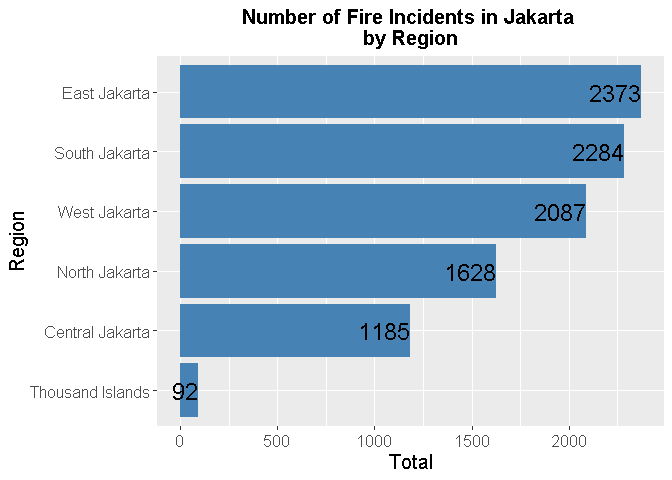

Causes of Fire Incidents in Jakarta
================
By: Radian Lukman
25 August, 2021

[](https://unsplash.com/@mchesin?utm_source=medium&utm_medium=referral)

According to [Indonesian National Board for Disaster
Management](https://bnpb.go.id/definisi-bencana), fire incident is a
situation where a building such as a house, factory, market, office and
others is hit by a fire that causes casualties and losses. Fire
incidents occur due to uncontrolled fires, usually caused by electrical
short circuit, cigarettes, and chemicals.

[](https://en.wikipedia.org/wiki/Fire_triangle)

The **fire triangle** or **combustion triangle** explains that the three
elements a fire needs to ignite: heat, fuel, and an oxidizing agent
(usually oxygen). Fires can occur anywhere and anytime with flammable
materials and sources of ignition. A fire naturally occurs when the
elements are present and combined in the right mixture. A fire can be
prevented or extinguished by removing any one of the elements in the
fire triangle.

As a province with the highest population density in Indonesia, Jakarta
is one of the areas prone to fire incidents. Negligence, carelessness,
and lack of public awareness of fire prevention are the **main factors**
that cause fire incidents.

Fire incidents can also occur due to other factors such as technical
factors and natural factors. **Technical factors** that can cause fire
incidents such as increasing temperature, short circuits, and chemical
reactions. **Natural factors** can also cause fire incidents such as
volcanic eruptions, earthquakes, lightning, and others.  
  
In this project, I will do an exploratory data analysis about causes of
fire incidents in Jakarta. The data was obtained from
[data.jakarta.go.id](https://data.jakarta.go.id/dataset/data-frekuensi-kebakaran-menurut-penyebabnya-di-provinsi-dki-jakarta)
and I have translated to English then merged it into one csv file. The
programming language that I’m using is **R**.

## 1. Load Packages

We will use readr, ggplot2, and dplyr for this analysis.

``` r
library(readr)
library(ggplot2)
library(dplyr)
```

    ## 
    ## Attaching package: 'dplyr'

    ## The following objects are masked from 'package:stats':
    ## 
    ##     filter, lag

    ## The following objects are masked from 'package:base':
    ## 
    ##     intersect, setdiff, setequal, union

## 2. Importing Data

``` r
data <- read_csv("CausesFireJakarta.csv")
```

    ## Parsed with column specification:
    ## cols(
    ##   year = col_double(),
    ##   region = col_character(),
    ##   causes = col_character(),
    ##   number = col_double()
    ## )

``` r
print(data)
```

    ## # A tibble: 216 x 4
    ##     year region           causes        number
    ##    <dbl> <chr>            <chr>          <dbl>
    ##  1  2015 Thousand Islands Electricity        1
    ##  2  2015 Thousand Islands Gas                0
    ##  3  2015 Thousand Islands Candle             0
    ##  4  2015 Thousand Islands Burning Trash      0
    ##  5  2015 Thousand Islands Cigarette          0
    ##  6  2015 Thousand Islands Others             7
    ##  7  2015 South Jakarta    Electricity      221
    ##  8  2015 South Jakarta    Gas               22
    ##  9  2015 South Jakarta    Candle             0
    ## 10  2015 South Jakarta    Burning Trash      0
    ## # ... with 206 more rows

The data that we are using is a comma separated value (csv) file named
`CausesFireJakarta.csv`. The data is imported using readr and stored
into a variable caled “data”. It can be seen that data has 216 rows
(number of observations) and 4 columns (number of variables).

We can search for unique values in “year”, “region”, and “causes” column
with:

``` r
unique(data[c("year")])
```

    ## # A tibble: 6 x 1
    ##    year
    ##   <dbl>
    ## 1  2015
    ## 2  2016
    ## 3  2017
    ## 4  2018
    ## 5  2019
    ## 6  2020

``` r
unique(data[c("region")])
```

    ## # A tibble: 6 x 1
    ##   region          
    ##   <chr>           
    ## 1 Thousand Islands
    ## 2 South Jakarta   
    ## 3 East Jakarta    
    ## 4 Central Jakarta 
    ## 5 West Jakarta    
    ## 6 North Jakarta

``` r
unique(data[c("causes")])
```

    ## # A tibble: 6 x 1
    ##   causes       
    ##   <chr>        
    ## 1 Electricity  
    ## 2 Gas          
    ## 3 Candle       
    ## 4 Burning Trash
    ## 5 Cigarette    
    ## 6 Others

-   ‘year’ column contains observation years from 2015 until 2020.

<!-- -->

-   ‘region’ column contains region names that consists of: Thousand
    Islands, South Jakarta, East Jakarta, Central Jakarta, West Jakarta,
    and North Jakarta.

-   ‘causes’ column contains causes of fire incidents that consists of:
    Electricity, Gas, Candle, Burning Trash, Cigarette, and ‘Others’.

## 3. Changing Data Type

When importing data, we can see that ‘year’ and ‘number’ columns are
*double* data type, the ‘region’ and ‘causes’ columns are *character*.
For further analysis, we will change ‘year’, ‘region’, and ‘causes’ into
category (*factor*).

``` r
data$year <- as.factor(data$year)
data$region <- as.factor(data$region)
data$causes <- as.factor(data$causes)
head(data)
```

    ## # A tibble: 6 x 4
    ##   year  region           causes        number
    ##   <fct> <fct>            <fct>          <dbl>
    ## 1 2015  Thousand Islands Electricity        1
    ## 2 2015  Thousand Islands Gas                0
    ## 3 2015  Thousand Islands Candle             0
    ## 4 2015  Thousand Islands Burning Trash      0
    ## 5 2015  Thousand Islands Cigarette          0
    ## 6 2015  Thousand Islands Others             7

Using that command, we have successfully changed the data type of
‘year’, ‘region’, and ‘causes’ column into category.

## 4. Checking Missing Value

``` r
sapply(data, function(x) sum(is.na(x)))
```

    ##   year region causes number 
    ##      0      0      0      0

The number of NA’s for each columns are 0, it means that the data is
clean and we can continue our analysis.

## 5. **Line Plot for Number of Fire Incidents Each Year**

To see the number of fire incidents each year, we can do aggregation in
the ‘year’ and ‘number’ column. After that the values ​​in the ‘number’
column will be summed for each year. The aggregated data is stored into
“yearly” variable. After that, we will make a plot using ggplot2.

``` r
yearly <- aggregate(number~year, data, sum)
```

``` r
ggplot(yearly, aes(x=year,y=number,group=1)) +
  geom_line(stat='identity',color='red',size=1.5) + 
  geom_point() +
  geom_text(aes(label=number),hjust=1.2, color="black", size=6, parse=TRUE) +
  ggtitle("Number of Fire Incidents In Jakarta \n 2015-2020") +
  labs(x='Year',y='Total') +
  theme(plot.title = element_text(hjust = 0.5,size=20,face='bold'),text = element_text(size=20))
```

<!-- -->

Based on the plot, the number of fire incidents in Jakarta fluctuates.
In 2015–2016, the number **decreased** from 1.568 incidents to 1.171
incidents. Then, in 2017 the number **increased** to its peak in 2019
with 2.183 incidents. In 2020, the number of incidents **decreased** to
1.505.

We can also see the number of fire incidents based on causes each year
by using groupby and summarise. To do this, we can use this command:

``` r
trend <- data %>%
  group_by(year,causes) %>%
  summarise(number = sum(number)) 
```

    ## `summarise()` has grouped output by 'year'. You can override using the `.groups` argument.

``` r
ggplot(trend,aes(x = year, y = number, colour = causes, group = causes)) +
  geom_line(size=1.2) +
  ggtitle("Number of Fire Incidents in Jakarta \n2015-2020") +
  labs(x='Year',y='Total') +
  theme(plot.title = element_text(hjust = 0.5,size=15,face='bold'),text = element_text(size=15)) +
  scale_colour_brewer(palette="Set1")
```

<!-- -->

The plot tells us that there are 5 causes with a significant number of
incidents: electricity, burning trash, gas, cigarette, and ‘others’.
Among the five, **the highest number of fire incidents is caused by
electricity**, followed by burning trash and ‘others’ respectively.
Meanwhile, fire incidents that caused by candle have the least number of
incidents.

## 6. **Bar Chart for Number of Fire Incidents**

To find out the number of fire incidents based on their cause, we
aggregate the data on ‘causes’ and ‘number’ column. The value in
‘number’ column will be summed for each cause. The aggregated data is
stored into the “causes” variable.

``` r
causes <- aggregate(number~causes, data, sum)
```

Next, we will make a bar chart for the number of fire incidents in
Jakarta by cause.

``` r
ggplot(causes, aes(x=reorder(causes,number),y=number)) +
  geom_bar(stat="identity", fill='steelblue') +
  geom_text(aes(label=number),hjust=1, color="black", size=6, parse=TRUE) +
  ggtitle("Number of Fire Incidents in Jakarta \nby Cause") +
  labs(x='Cause',y='Total') +
  theme(plot.title = element_text(hjust = 0.5,size=15,face='bold'),text = element_text(size=15)) +
  coord_flip()
```

<!-- -->

From the bar chart, we can verify our previous assumption that there are
5 causes with a significant number of incidents, they are electricity,
gas, burning trash, cigarette, and ‘others’. We can see the total number
of fire incidents for each cause inside the chart.

We can also make a bar chart for the number of fire incidents in Jakarta
by region:

``` r
region <- aggregate(number~region,data,sum)
```

``` r
ggplot(region, aes(x=reorder(region,number),y=number)) +
  geom_bar(stat="identity", fill='steelblue') +
  geom_text(aes(label=number),hjust=1, color="black", size=6, parse=TRUE) +
  ggtitle("Number of Fire Incidents in Jakarta \nby Region") +
  labs(x='Region',y='Total') +
  theme(plot.title = element_text(hjust = 0.5,size=15,face='bold'),text = element_text(size=15)) +
  coord_flip()
```

<!-- -->

From the bar chart, we can see that **East Jakarta has the highest
number fire incidents** with a total of 2.373 incidents then followed by
South Jakarta (2.284), West Jakarta (2.087), North Jakarta (1.628),
Central Jakarta (1.185), and the Thousand Islands (92).

## 7. **Bar Chart with Multicategory (*Facet Wrap*)**

We are going to create multiple bar charts for the number of fire
incidents based on cause and the charts are separated by year:

``` r
ggplot(data, aes(x=causes,y=number,fill=causes)) +
  geom_bar(stat="identity") +
  ggtitle("Number of Fire Incidents in Jakarta Based on Cause \nSeperated by Year") +
  labs(x='Cause',y='Total') +
  theme(plot.title = element_text(hjust=0.5,size=15,face='bold'),axis.text.x=element_text(angle = 90,vjust = 0.5, hjust=1),text = element_text(size=15)) + 
  facet_wrap(~year)
```

<!-- -->

The chart is quite useful because we can see what are the cause of fire
incident that have the highest number each year. For example, in 2015
the causes of fire incidents in Jakarta was dominated by electricity and
‘others’. The highest number of fire incidents that caused by
electricity occurred in 2019.

Next, we can also create multiple bar charts for the number of fire
incidents based on cause and the charts are separated by region:

``` r
ggplot(data, aes(x=causes,y=number,fill=causes)) +
  geom_bar(stat="identity") +
  ggtitle("Number of Fire Incidents in Jakarta Based on Cause \nSeperated by Region") +
  labs(x='Cause',y='Total') +
  theme(plot.title = element_text(hjust=0.5,size=15,face='bold'),axis.text.x=element_text(angle = 90,vjust = 0.5, hjust=1),text = element_text(size=15)) + 
  facet_wrap(~region) 
```

<!-- -->

From the chart, it can be seen that fire incidents that caused by
**electricity has the highest number of incidents in each region**. It
then followed by ‘others’ and gas in each region.

Finally, we can create multiple bar charts for the number of fire
incidents based on region and the charts are separated by year:

``` r
ggplot(data, aes(x=region,y=number,fill=region)) +
  geom_bar(stat="identity") +
  ggtitle("Number of Fire Incidents in Jakarta Based on Region \nSeperated by Year") +
  labs(x='Region',y='Total') +
  theme(plot.title = element_text(hjust=0.5,size=15,face='bold'),axis.text.x=element_text(angle = 90,vjust = 0.5, hjust=1),text = element_text(size=15)) + 
  facet_wrap(~year) 
```

<!-- -->

From the chart, we can see that **East Jakarta has the highest number of
fire incidents almost every year** (except in 2017 and 2020) then
followed by South Jakarta and West Jakarta. The number of fire incidents
in Thousand Islands, Central Jakarta, and North Jakarta fluctuate every
year.

## Conclusion

1.  The number of fire incidents in Jakarta from 2016 to 2019
    **increased** and reached its peak in 2019 with 2.183 incidents. The
    number then decreased in 2020 with a total of 1.505 incidents.

2.  During 2015–2020, **electricity** was the main cause of fire
    incidents in Jakarta with a total of 5.874 incidents. It then
    followed by ‘**others**’ with 1.426 incidents and **gas** with 960
    incidents. The highest number of fire incidents that caused by
    electricity occurred in 2019.

3.  Every year, **gas**, **candle**, and ‘**others**’ are the causes
    that dominate the fire incidents in Jakarta. These three causes are
    also relatively high in each region.

4.  **East Jakarta** is the region with the highest number of fire
    incidents both in total and annually. Then followed by South Jakarta
    and West Jakarta.

That’s all of the exploratory data analysis that I can explain. I hope
these results can be useful as a consideration for policy making or
further research. If you are interested in this project, you can access
the dataset and syntax on [my
GitHub](https://github.com/radianlukman/Causes-of-Fire-Incidents-in-Jakarta).

Thank you!
