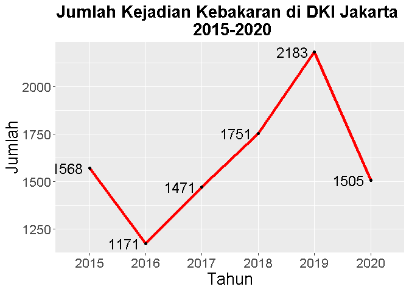
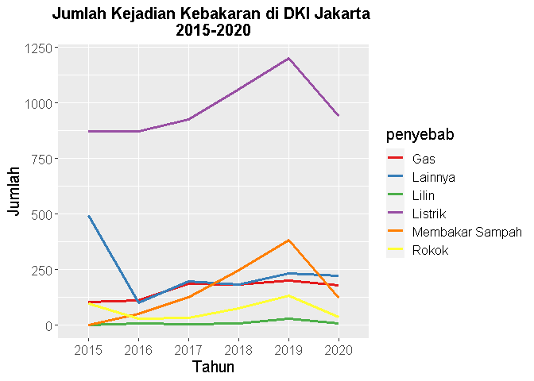
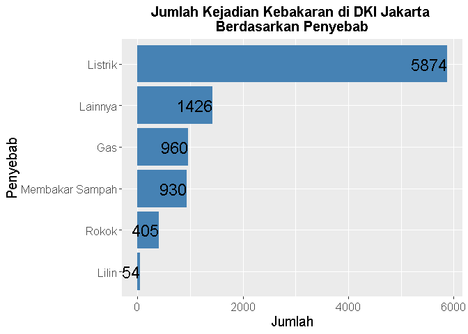
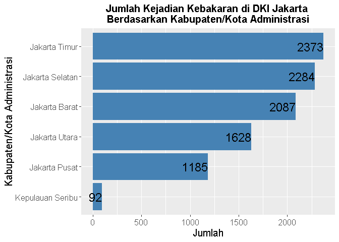
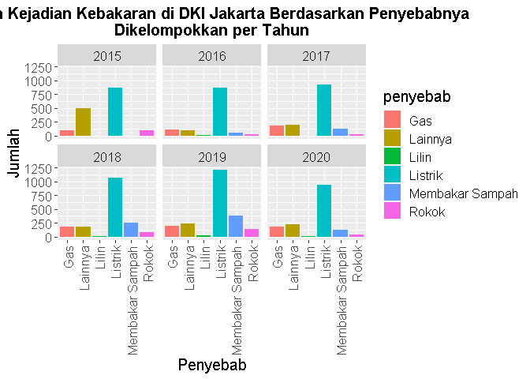
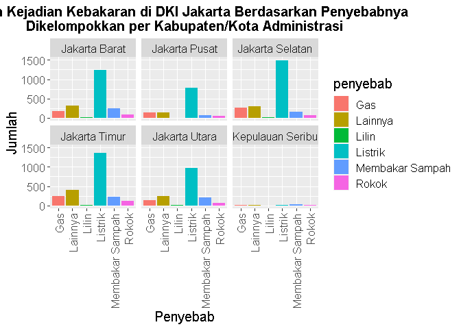
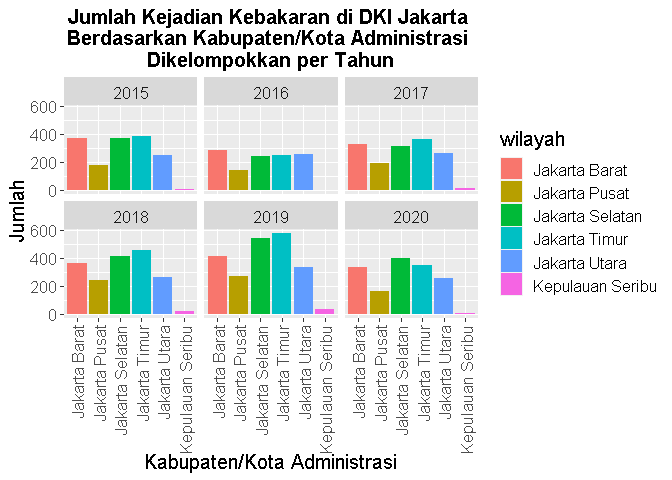

Penyebab Kebakaran di DKI Jakarta - Analisis Data Eksploratif
================
Radian Lukman

# Penyebab Kebakaran di DKI Jakarta - Analisis Data Eksploratif

[](https://unsplash.com/@mchesin?utm_source=medium&utm_medium=referral)

Menurut [Badan Nasional Penanggulangan Bencana
(BNPB)](https://bnpb.go.id/definisi-bencana), kebakaran merupakan
situasi dimana bangunan pada suatu tempat seperti rumah/pemukiman,
pabrik, pasar, gedung dan lain-lain dilanda api yang menimbulkan korban
dan/atau kerugian. Kebakaran terjadi akibat adanya api yang tidak
terkendali, umumnya disebabkan oleh konsleting listrik, rokok, dan bahan
kimia.

[](https://www.pemadamapi.co.id/apar-hcfc/apar-hcfc-dalam-segitiga-api/)

Segitiga Api menjelaskan bahwa munculnya api membutuhkan 3 komponen
yaitu **bahan mudah terbakar**, **oksigen**, dan **panas**. Kebakaran
dapat terjadi dimana saja dan kapan saja dengan bahan dan sumber api
yang mudah terbakar.

Sebagai provinsi dengan kepadatan penduduk tertinggi di Indonesia, DKI
Jakarta menjadi salah satu daerah yang rawan terjadi kebakaran.
Kelalaian, kecerobohan, serta kurangnya kewaspadaan masyarakat terhadap
pencegahan kejadian kebakaran merupakan **faktor utama** yang
menyebabkan terjadinya kebakaran.

Kebakaran juga dapat terjadi akibat faktor lain seperti faktor teknis
dan faktor alam. **Faktor teknis** yang dapat menimbulkan kebakaran
seperti peningkatan suhu, hubungan airs pendek, dan reaksi kimia.
**Faktor alam** juga dapat mengakibatkan kebakaran seperti gunung
meletus, gempa, kilatan petir, dan lain-lain.

Pada kesempatan kali ini, saya akan melakukan analisis data eksploratif
mengenai penyebab kejadian kebakaran di DKI Jakarta. Data tersebut
diperoleh dari
[data.jakarta.go.id](https://data.jakarta.go.id/dataset/data-frekuensi-kebakaran-menurut-penyebabnya-di-provinsi-dki-jakarta)
dan telah saya gabung menjadi satu file berformat csv. Bahasa
pemrograman yang dipakai adalah **R**.

## 1. Load Packages

*Packages* yang digunakan adalah readr, ggplot2, dan dplyr.

``` r
library(readr)
library(ggplot2)
library(dplyr)
```

    ## 
    ## Attaching package: 'dplyr'

    ## The following objects are masked from 'package:stats':
    ## 
    ##     filter, lag

    ## The following objects are masked from 'package:base':
    ## 
    ##     intersect, setdiff, setequal, union

## 2. Import Data

``` r
data <- read_csv("PenyebabKebakaranJakarta.csv")
```

    ## Parsed with column specification:
    ## cols(
    ##   tahun = col_double(),
    ##   wilayah = col_character(),
    ##   penyebab = col_character(),
    ##   jumlah = col_double()
    ## )

``` r
print(data)
```

    ## # A tibble: 216 x 4
    ##    tahun wilayah          penyebab        jumlah
    ##    <dbl> <chr>            <chr>            <dbl>
    ##  1  2015 Kepulauan Seribu Listrik              1
    ##  2  2015 Kepulauan Seribu Gas                  0
    ##  3  2015 Kepulauan Seribu Lilin                0
    ##  4  2015 Kepulauan Seribu Membakar Sampah      0
    ##  5  2015 Kepulauan Seribu Rokok                0
    ##  6  2015 Kepulauan Seribu Lainnya              7
    ##  7  2015 Jakarta Selatan  Listrik            221
    ##  8  2015 Jakarta Selatan  Gas                 22
    ##  9  2015 Jakarta Selatan  Lilin                0
    ## 10  2015 Jakarta Selatan  Membakar Sampah      0
    ## # ... with 206 more rows

Data yang digunakan merupakan data berformat *comma seperated value*
(csv) bernama `PenyebabKebakaranJakarta.csv`. Data tersebut diimport
menggunakan readr dan dimasukkan ke variabel bernama “data”. Dapat
dilihat, data memiliki 216 baris (jumlah pengamatan) dan 4 kolom (jumlah
variabel).

Kita dapat melihat nilai unik (*unique values*) pada kolom “tahun”,
“wilayah”, dan “penyebab” dengan:

``` r
unique(data[c("tahun")])
```

    ## # A tibble: 6 x 1
    ##   tahun
    ##   <dbl>
    ## 1  2015
    ## 2  2016
    ## 3  2017
    ## 4  2018
    ## 5  2019
    ## 6  2020

``` r
unique(data[c("wilayah")])
```

    ## # A tibble: 6 x 1
    ##   wilayah         
    ##   <chr>           
    ## 1 Kepulauan Seribu
    ## 2 Jakarta Selatan 
    ## 3 Jakarta Timur   
    ## 4 Jakarta Pusat   
    ## 5 Jakarta Barat   
    ## 6 Jakarta Utara

``` r
unique(data[c("penyebab")])
```

    ## # A tibble: 6 x 1
    ##   penyebab       
    ##   <chr>          
    ## 1 Listrik        
    ## 2 Gas            
    ## 3 Lilin          
    ## 4 Membakar Sampah
    ## 5 Rokok          
    ## 6 Lainnya

-   Kolom ‘tahun’ berisikan tahun pengamatan dari 2015 sampai
    dengan 2020.

-   Kolom ‘wilayah’ berisikan nama kabupaten/kota administrasi yang
    beranggotakan: Kepulauan Seribu, Jakarta Selatan, Jakarta Timur,
    Jakarta Pusat, Jakarta Barat, dan Jakarta Utara.

-   Kolom ‘penyebab’ berisikan penyebab kebakaran yang beranggotakan:
    Listrik, Gas, Lilin, Membakar Sampah, Rokok, dan ‘Lainnya’.

## 3. Mengubah Jenis Data

Pada saat *import data*, data pada kolom ‘tahun’ dan ‘jumlah’ berjenis
*double*, kolom ‘wilayah ’dan ’penyebab’ berjenis *character*. Untuk
analisis lebih lanjut, kolom ‘tahun’, ‘wilayah’, dan ‘penyebab’ akan
diubah menjadi kategori (*factor*).

``` r
data$tahun <- as.factor(data$tahun)
data$wilayah <- as.factor(data$wilayah)
data$penyebab <- as.factor(data$penyebab)
print(data)
```

    ## # A tibble: 216 x 4
    ##    tahun wilayah          penyebab        jumlah
    ##    <fct> <fct>            <fct>            <dbl>
    ##  1 2015  Kepulauan Seribu Listrik              1
    ##  2 2015  Kepulauan Seribu Gas                  0
    ##  3 2015  Kepulauan Seribu Lilin                0
    ##  4 2015  Kepulauan Seribu Membakar Sampah      0
    ##  5 2015  Kepulauan Seribu Rokok                0
    ##  6 2015  Kepulauan Seribu Lainnya              7
    ##  7 2015  Jakarta Selatan  Listrik            221
    ##  8 2015  Jakarta Selatan  Gas                 22
    ##  9 2015  Jakarta Selatan  Lilin                0
    ## 10 2015  Jakarta Selatan  Membakar Sampah      0
    ## # ... with 206 more rows

Dengan perintah tersebut, jenis data pada kolom ‘tahun’, ‘wilayah’, dan
‘penyebab’ berhasil diubah menjadi *factor*.

## 4. Mengecek Missing Value

``` r
sapply(data, function(x) sum(is.na(x)))
```

    ##    tahun  wilayah penyebab   jumlah 
    ##        0        0        0        0

Jumlah data yang NA pada tiap kolom berjumlah 0 yang berarti data sudah
bersih dan dapat diolah ke tahap selanjutnya.

## 5. **Line Plot Jumlah Kejadian Kebakaran Tiap Tahun**

Untuk dapat melihat jumlah kejadian kebakaran tiap tahun, kita dapat
melakukan *aggregate* pada kolom ‘tahun’ dan ‘jumlah’. Setelah itu nilai
pada kolom ‘jumlah’ akan dijumlahkan tiap tahun. Data yang telah
diagregasi tersebut dimasukkan ke dalam variabel “pertahun”. Setelah itu
kita membuat plot menggunakan ggplot2.

``` r
pertahun <- aggregate(jumlah~tahun, data, sum)
```

``` r
ggplot(pertahun, aes(x=tahun,y=jumlah,group=1)) +
  geom_line(stat='identity',color='red',size=1.5) + 
  geom_point() +
  geom_text(aes(label=jumlah),hjust=1.2, color="black", size=6, parse=TRUE) +
  ggtitle("Jumlah Kejadian Kebakaran di DKI Jakarta \n 2015-2020") +
  labs(x='Tahun',y='Jumlah') +
  theme(plot.title = element_text(hjust = 0.5,size=20,face='bold'),text = element_text(size=20))
```

<!-- -->

Berdasarkan plot tersebut, jumlah kejadian kebakaran di DKI Jakarta
**fluktuatif**. Pada tahun 2015–2016, kejadian kebakaran **menurun**
dari 1.568 kejadian menjadi 1.171 kejadian. Kemudian, pada tahun 2017
kejadian kebakaran **meningkat** hingga puncaknya pada tahun 2019
sebanyak 2.183 kejadian. Di tahun 2020, kejadian kebakaran **menurun**
menjadi 1505 kejadian.

Kita juga dapat menghitung jumlah kejadian kebakaran berdasarkan
penyebabnya tiap tahun dengan menggunakan *groupby* dan *summarise*.

``` r
trend <- data %>%
          group_by(tahun,penyebab) %>%
          summarise(jumlah = sum(jumlah)) 
```

    ## `summarise()` has grouped output by 'tahun'. You can override using the `.groups` argument.

``` r
ggplot(trend,aes(x = tahun, y = jumlah, colour = penyebab, group = penyebab)) +
  geom_line(size=1.2) +
  ggtitle("Jumlah Kejadian Kebakaran di DKI Jakarta \n2015-2020") +
  labs(x='Tahun',y='Jumlah') +
  theme(plot.title = element_text(hjust = 0.5,size=15,face='bold'),text = element_text(size=15)) +
  scale_colour_brewer(palette="Set1")
```

<!-- -->

Plot tersebut memberi informasi bahwa terdapat 5 penyebab yang jumlah
kejadiannya signifikan yaitu: listrik, membakar sampah, gas, rokok, dan
‘lainnya’. Diantara kelimanya, kejadian kebakaran yang diakibatkan
karena **listrik menduduki peringkat pertama** dengan jumlah kejadian
terbanyak. Penyebab lain yaitu lilin menjadi penyebab kejadian kebakaran
dengan jumlah kejadian paling sedikit.

## 6. **Bar Chart Jumlah Penyebab Kejadian Kebakaran**

Untuk dapat mengetahui jumlah kejadian kebakaran berdasarkan
penyebabnya, kita dapat melakukan *aggregate* pada kolom penyebab dan
jumlah. Setelah itu nilai pada kolom ‘jumlah’ akan dijumlahkan tiap
penyebab. Data yang telah diagregasi tersebut dimasukkan ke dalam
variabel “penyebab”.

``` r
penyebab <- aggregate(jumlah~penyebab, data, sum)
```

Selanjutnya, kita akan membuat *bar chart* jumlah kejadian kebakaran di
DKI Jakarta berdasarkan penyebabnya.

``` r
ggplot(penyebab, aes(x=reorder(penyebab,jumlah),y=jumlah)) +
  geom_bar(stat="identity", fill='steelblue') +
  geom_text(aes(label=jumlah),hjust=1, color="black", size=6, parse=TRUE) +
  ggtitle("Jumlah Kejadian Kebakaran di DKI Jakarta \nBerdasarkan Penyebab") +
  labs(x='Penyebab',y='Jumlah') +
  theme(plot.title = element_text(hjust = 0.5,size=15,face='bold'),text = element_text(size=15)) +
  coord_flip()
```

<!-- -->

Dari *bar chart* tersebut, kita dapat memverifikasi dugaan kita
sebelumnya bahwa memang terdapat 5 penyebab yang jumlah penderitanya
signifikan yaitu listrik, gas, membakar sampah, rokok, dan ‘lainnya’.
Kita dapat melihat jumlah kejadian pada masing-masing penyebab di *bar
chart* tersebut.

Kita juga dapat membuat *bar chart* jumlah kejadian kebakaran di DKI
Jakarta berdasarkan wilayah (kabupaten/kota administrasi):

``` r
wilayah <- aggregate(jumlah~wilayah,data,sum)
```

``` r
ggplot(wilayah, aes(x=reorder(wilayah,jumlah),y=jumlah)) +
  geom_bar(stat="identity", fill='steelblue') +
  geom_text(aes(label=jumlah),hjust=1, color="black", size=6, parse=TRUE) +
  ggtitle("Jumlah Kejadian Kebakaran di DKI Jakarta \nBerdasarkan Kabupaten/Kota Administrasi") +
  labs(x='Kabupaten/Kota Administrasi',y='Jumlah') +
  theme(plot.title = element_text(hjust = 0.5,size=15,face='bold'),text = element_text(size=15)) +
  coord_flip()
```

<!-- -->

Dari *bar chart* tersebut, kita dapat mengetahui bahwa Kota Administrasi
Jakarta Timur menduduki peringkat pertama dengan jumlah kejadian
sebanyak 2.373. Kemudian disusul oleh Jakarta Selatan (2.284), Jakarta
Barat (2.087), Jakarta Utara (1.628), Jakarta Pusat (1.185), dan
Kepulauan Seribu (92).

## 7. **Bar Chart Dengan Multikategori (*Facet Wrap*)**

Kita akan membuat *bar chart* jumlah kejadian kebakaran berdasarkan
penyebabnya dan *bar chart* tersebut dipisah sesuai tahun:

``` r
ggplot(data, aes(x=penyebab,y=jumlah,fill=penyebab)) +
  geom_bar(stat="identity") +
  ggtitle("Jumlah Kejadian Kebakaran di DKI Jakarta Berdasarkan Penyebabnya \nDikelompokkan per Tahun") +
  labs(x='Penyebab',y='Jumlah') +
  theme(plot.title = element_text(hjust=0.5,size=15,face='bold'),axis.text.x=element_text(angle = 90,vjust = 0.5, hjust=1),text = element_text(size=15)) + 
  facet_wrap(~tahun)
```

<!-- -->

*Chart* tersebut sangat bermafaat untuk mengetahui secara keseluruhan
penyebab kebakaran apa yang jumlah kejadiannya tertinggi tiap tahun.
Pada tahun 2015, penyebab kebakaran di DKI Jakarta didominasi oleh
listrik dan ‘lainnya’. Jumlah kejadian kebakaran yang diakibatkan oleh
listrik tertinggi terjadi pada tahun 2019.

Selanjutnya, kita juga dapat mencari tahu jumlah kejadian kebakaran
berdasarkan penyebabnya pada tiap kabupaten/kota administrasi dengan
perintah:

``` r
ggplot(data, aes(x=penyebab,y=jumlah,fill=penyebab)) +
  geom_bar(stat="identity") +
  ggtitle("Jumlah Kejadian Kebakaran di DKI Jakarta Berdasarkan Penyebabnya \nDikelompokkan per Kabupaten/Kota Administrasi") +
  labs(x='Penyebab',y='Jumlah') +
  theme(plot.title = element_text(hjust=0.5,size=15,face='bold'),axis.text.x=element_text(angle = 90,vjust = 0.5, hjust=1),text = element_text(size=15)) + 
  facet_wrap(~wilayah) 
```

<!-- -->

Dari *chart* tersebut, dapat diketahui bahwa **listrik tetap menjadi
penyebab kebakaran yang tertinggi di tiap kabupaten/kota administrasi**.
Penyebab ’lainnya ’menduduki peringkat ke-2 dan penyebab gas menduduki
peringkat ke-3 di tiap kabupaten/kota administrasi.

Terakhir, kita dapat mengetahui jumlah kejadian kebakaran berdasarkan
kabupaten/kota administrasi tiap tahun dengan perintah:

``` r
ggplot(data, aes(x=wilayah,y=jumlah,fill=wilayah)) +
  geom_bar(stat="identity") +
  ggtitle("Jumlah Kejadian Kebakaran di DKI Jakarta \nBerdasarkan Kabupaten/Kota Administrasi \nDikelompokkan per Tahun") +
  labs(x='Kabupaten/Kota Administrasi',y='Jumlah') +
  theme(plot.title = element_text(hjust=0.5,size=15,face='bold'),axis.text.x=element_text(angle = 90,vjust = 0.5, hjust=1),text = element_text(size=15)) + 
  facet_wrap(~tahun) 
```

<!-- -->

Dari *chart* tersebut, dapat diketahui jumlah **kejadian kebakaran di
Kota Adminisrasi Jakarta Timur tertinggi hampir tiap tahun** (kecuali
pada tahun 2017 dan 2020). Kemudian disusul oleh Jakarta Selatan dan
Jakarta Barat. Kasus di Kepulauan Seribu, Jakarta Pusat, dan Jakarta
Utara fluktuatif tiap tahun.

## Kesimpulan

1.  Jumlah kejadian kebakaran di DKI Jakarta pada tahun 2016–2019
    **meningkat** dan mencapai puncaknya pada tahun 2019 sebanyak 2.183
    kejadian. Jumlah kejadian kemudian **menurun** pada tahun 2020
    dengan total 1.505 kejadian.

2.  Sepanjang tahun 2015–2020, **listrik** merupakan penyebab kebakaran
    dengan jumlah tertinggi yaitu sebanyak 5.874 kejadian. Penyebab
    **‘lainnya’** menduduki peringkat ke-2 yaitu sebanyak 1.426 kasus
    dan **gas** berada pada peringkat ke-3 dengan 960 kasus. Jumlah
    kejadian kebakaran yang diakibatkan oleh listrik tertinggi terjadi
    pada tahun 2019.

3.  Setiap tahun, penyebab yang mendominasi kejadian kebakaran di DKI
    Jakarta adalah **gas**, **lilin**, dan dan **‘lainnya’**. Ketiga
    penyebab tersebut juga relatif tertinggi pada tiap kabupaten/kota
    administrasi.

4.  **Jakarta Timur** menjadi kota administrasi dengan rata-rata jumlah
    kejadian kebakaran tertinggi baik secara total maupun tiap tahun.
    Kemudian disusuli Jakarta Selatan dan Jakarta Barat.

Sekian analisis data eksploratif yang bisa saya jelaskan. Saya harap,
hasil ini dapat bermanfaat sebagai bahan pengambilan kebijakan atau
penelitian lebih lanjut. Jika Anda tertarik akan *project* ini, Anda
bisa akses dataset dan syntax pada [GitHub
saya](https://github.com/radianlukman/Causes-of-Fire-Accidents-in-Jakarta).

Terima kasih!
