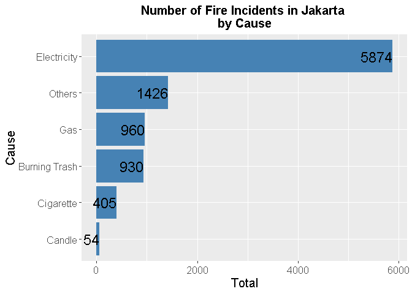

# Causes of Fire Incidents in Jakarta - Explaratory Data Analysis

In this project, we are going to perform an Exparatory Data Analysis of the Causes of Fire Incidents in Jakarta 2015-2020 dataset.

You can view the full project [here](https://github.com/radianlukman/Causes-of-Fire-Incidents-in-Jakarta/blob/main/Causes-of-Fire-Incidents-in-Jakarta.md).

## Folders

| Folder Name                               | Description                                  |
|-------------------------------------------|----------------------------------------------|
| [Causes-of-Fire-Incidents-in-Jakarta_files](https://github.com/radianlukman/Causes-of-Fire-Incidents-in-Jakarta/tree/main/Causes-of-Fire-Incidents-in-Jakarta_files/figure-gfm) | Plots in project markdown (English)          |
| [images](https://github.com/radianlukman/Causes-of-Fire-Incidents-in-Jakarta/tree/main/images)                                    | Pictures used in markdown                    |

## Files
- [Causes of Fire Incidents in Jakarta (2015-2020) Data](https://github.com/radianlukman/Causes-of-Fire-Incidents-in-Jakarta/blob/main/CausesFireJakarta.csv)

| File Name                               | Description    |
|-----------------------------------------|----------------|
| [Causes-of-Fire-Incidents-in-Jakarta.md](https://github.com/radianlukman/Causes-of-Fire-Incidents-in-Jakarta/blob/main/Causes-of-Fire-Incidents-in-Jakarta.md)  | Full project   |
| [Causes of Fire Incidents in Jakarta.Rmd](https://github.com/radianlukman/Causes-of-Fire-Incidents-in-Jakarta/blob/main/Causes%20of%20Fire%20Incidents%20in%20Jakarta.Rmd) | RMarkdown file |
| [CasuesFireJakarta.R](https://github.com/radianlukman/Causes-of-Fire-Incidents-in-Jakarta/blob/main/CausesFireJakarta.R)                     | Plots syntax   |

## Plot Previews

